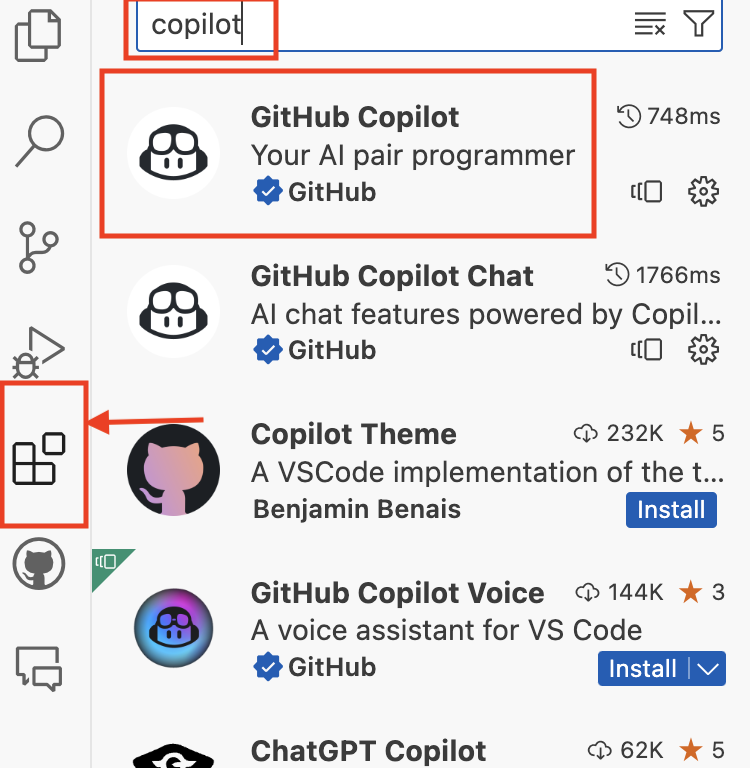
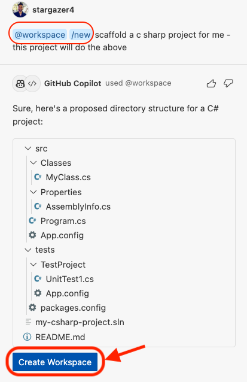
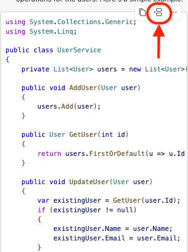
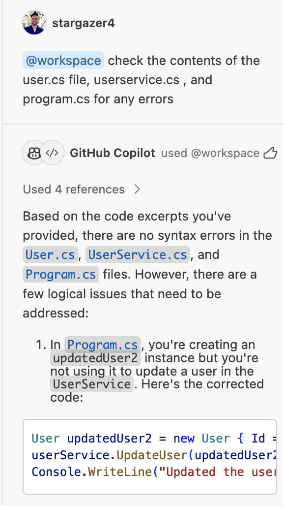
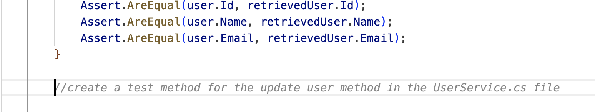

# C# Project Workshop with GitHub Copilot

Welcome to this interactive workshop where we will use GitHub Copilot to create a C# project with CRUD operations. This project will allow us to add, update, and delete users.

## Getting Started

### Launch Codespace
Start by launching your Codespace environment.

### Familiarize Yourself with the Project Directory
Take a moment to explore the project directory. (Surprise! It's empty)

### Install Copilot Extension
Navigate to the extensions tab on the left hand side of the codespace. Search 'copilot' and install the GitHub Copilot extension. Note that this will also install the chat feature. 




### Open Copilot Chat
Open up the chat feature and say hello to Copilot!

### Explore Built-in Commands
GitHub Copilot chat includes built-in commands (hotkeys) for common tasks. You can explore these using the `/` command in chat.

## Creating a New Workspace

### Create a New Workspace
Start typing `new` in the chat and choose the `new workspace` option. Ask Copilot to `scaffold a new C# project`. Copilot will create a new workspace and present you with a convenient button to create the workspace for you. Click this button, name the workspace `my-csharp-project` (see second image below) and wait for the Codespace to reload. (see image below)




### Explore the New Project
Once the Codespace has reloaded, familiarize yourself with the contents of the new project and its directories.

## Building the Application
We will use Copilot in the IDE to create a `User` class with `ID`, `Name`, and `Email` properties, along with their respective `get` and `set` methods.


### Create a User Class

We will use Copilot in the IDE to create a `User` class with `ID`, `Name`, and `Email` properties, along with their respective `get` and `set` methods.

Navigate to the `/src/Classes` directory and create a new file called `User.cs`. At the top, we will write a comment to prompt GitHub Copilot:

```csharp
// setup a class called User with 3 properties: Id, Name, and Email
// The properties are defined using the get and set accessors.
// Use the appropriate namespace for the project (MyCSharpProject.Classes).
// The set accessor assigns a new value to the property, and the get accessor returns the property value.
```

The contents returned should be something along the lines of:

```csharp
using System;

namespace MyCSharpProject.Classes
{ 
    public class User
    {
        public int Id { get; set; }
        public string Name { get; set; }
        public string Email { get; set; }
    }
}
```

Alternatively, you may begin typing into the file the solution above, and see what suggestions Copilot returns along the way. 

### Create a User Service
We will ask **Copilot chat** to create the `UserService`. This service will handle the CRUD operations for our `User` objects.

Navigate to the `/src/Classes` directory and create a new file called `UserService.cs`. We will use GitHub Copilot chat to generate the contents of this service file. 
In the chat interface, prompt copilot to 

```csharp 
// We are creating a simple C# console application that performs basic CRUD operations on a list of users. Create a UserService class in the MyCSharpProject.Classes namespace that manages a list of User objects. The User class has properties Id, Name, and Email. The UserService class should have methods to add a user, get a user by id, update a user's details, and delete a user by id.
```


The response should contain code similar to the following solution below: 

```csharp
using System.Collections.Generic;
using System.Linq;
namespace MyCSharpProject.Classes{ 
public class UserService
{
    private List<User> users = new List<User>();

    public void AddUser(User user)
    {
        users.Add(user);
    }

    public User GetUser(int id)
    {
        return users.FirstOrDefault(u => u.Id == id);
    }

    public void UpdateUser(User user)
    {
        var existingUser = GetUser(user.Id);
        if (existingUser != null)
        {
            existingUser.Name = user.Name;
            existingUser.Email = user.Email;
        }
    }

    public void DeleteUser(int id)
    {
        var user = GetUser(id);
        if (user != null)
        {
            users.Remove(user);
        }
    }
}
}
```
Use the built-in `insert` button (see below) in the chat response interface to insert at the cursor in your `UserService.cs` file. 



### Create the Entry Point
Navigate to the `Program.cs` file (in the root directory) and use Copilot chat to create the entry point for our project.

```csharp 
// This file contains the Main method where you create an instance of UserService and perform operations like adding, getting, updating, and deleting users. 
// create a main program that uses the UserService class to add, get, update, and delete a User. The User class has properties Id, Name, and Email. The UserService class has methods to add a user, get a user by id, update a user's details, and delete a user by id. Demonstrate these operations in the Main method.
```
The response should contain code similar to the following solution below: 

```csharp 
using System;
using MyCSharpProject.Classes;

public class Program
{
    static void Main(string[] args)
    {
        UserService userService = new UserService();

        // Add a user
        userService.AddUser(new User { Id = 1, Name = "John Doe", Email = "john.doe@example.com" });

        // Get a user
        User user = userService.GetUser(1);
        Console.WriteLine($"Got user: {user.Name}");

        // Update a user
        user.Name = "Jane Doe";
        userService.UpdateUser(user);

        // Delete a user
        userService.DeleteUser(1);
    }
}
```
Use the built-in `insert` button (see below) in the chat response interface to insert at the cursor in your `UserService.cs` file. 


### Add additional users
Use Copilot to add additional users in the `Program.cs` file. 

### Review the Code
Another use case for GitHub Copilot chat is code review. For an extra set of eyes, you may highlight the contents of each of the three files and ask Copilot to review them for syntax errors or any other issues.

Alternatively, you may use the built-in `/workspace` command and ask Copilot chat to check the contents of specific files for errors (see image below):



#### Document existing code
Copilot Chat can be leverage to document existing codebases. Highlight the contents of the `UserService.cs` file (or any file of your choice) and ask Copilot Chat to `modify this file in order to include documentation in the form of inline comments`. Review the response and notice how Copilot can aide in documenting existing codebases - making it much easier for developers to understand how to navigate complex and unfamiliar codebases. 

### Generate the .csproj File
Navigate to your `.csproj` file in the `/src` directory - if it doesn't have one already, create the file and name it based on your project name, ie: `MyCSharpProject.csproj`. Navigate to Copilot Chat to generate the contents for the `.csproj` file. Ask Copilot to use .NET version 7 and to include the appropriate `ItemGroup` elements.

```csharp 
// Create a .NET project file that targets .NET 7.0, outputs an executable, and includes Program.cs and all C# files in the Classes directory
```

The response should contain code similar to the following solution below: 

```csharp
<Project Sdk="Microsoft.NET.Sdk">

    <PropertyGroup>
        <OutputType>Exe</OutputType>
        <TargetFramework>net7.0</TargetFramework>
        <EnableDefaultCompileItems>false</EnableDefaultCompileItems>
    </PropertyGroup>

    <ItemGroup>
        <Compile Include="Program.cs" />
        <Compile Include="Classes/*.cs" />
    </ItemGroup>

</Project>
```

## Running the Application

### Build the Project
Now we're ready to build the project. Navigate to the `/src` directory via the terminal and run `dotnet build`. If you run into any errors, copy and paste the contents of the error into Copilot chat and use it as an aide to guide you towards a fix. 

### Run the Application
Use `dotnet run` to run the application.

## Testing and Debugging

### Generate Tests
Use Copilot to generate tests for your application. Test files are located in the `/tests` directory.

Create a test file and name it `UserServiceTests.cs` - this should be created in the `/tests/MyCSharpProject.Tests` directory. Ask Copilot Chat to `generate unit tests for the addUser, getUserById, deleteUser and updateUser methods in the UserService.cs file` - you'll want to review the output and modify accordingly to ensure the appropriate function names are being used. 

Alternatively, you may generate the unit tests one method at a time, using inline comments to prompt Copilot. Begin typing the following and press enter to see Copilots suggestions. Sometimes, you will need to hit enter twice (to have a new line) in order to generate suggestions for the next block of code. 

```csharp
//create a test method for the add user method in the UserService.cs file
```

Review the response provided by Copilot, accept the suggestions and edit as necessary.

Once the first test is created, you'll notice that if you have a new line between the previous chunk of code, Copilot should begin to prompt for additional tests (see image below):



Run through and create a few different tests. Below is a sample output -- keep in mind your solution will look a bit different.

```csharp
using System;
using Microsoft.VisualStudio.TestTools.UnitTesting;
using MyCSharpProject.Classes;


namespace MyCSharpProject.Tests
{
    [TestClass]
    public class UserServiceTests
    {
        //create a test method for the add user method in the UserService.cs file
        [TestMethod]
        public void TestAddUser()
        {
            // Arrange
            int id = 1;
            string name = "Test User";
            string email = "testuser@example.com";

            // Act
            User user = new User { Id = id, Name = name, Email = email };


            // Assert
            Assert.AreEqual(id, user.Id);
            Assert.AreEqual(name, user.Name);
            Assert.AreEqual(email, user.Email);


        }


        //create a test method for the get user by id method in the UserService.cs file
        [TestMethod]
        public void TestGetUserById()
        {
            // Arrange
            UserService userService = new UserService();
            User user = new User { Id = 1, Name = "Test User", Email = "testemail@example.com" };
            userService.AddUser(user);

            // Act
            User retrievedUser = userService.GetUserById(1);

            // Assert
            Assert.AreEqual(user.Id, retrievedUser.Id);
            Assert.AreEqual(user.Name, retrievedUser.Name);
            Assert.AreEqual(user.Email, retrievedUser.Email);
        }

        //create a test method for the update user method in the UserService.cs file
        [TestMethod]
        public void TestUpdateUser()
        {
            // Arrange
            UserService userService = new UserService();
            User user = new User { Id = 1, Name = "Test User", Email = "testuser@example.com" };
            userService.AddUser(user);
            User updatedUser = new User { Id = 1, Name = "Test User", Email = "newemail@example.com" };

            // Act
            userService.UpdateUser(updatedUser);
            User retrievedUser = userService.GetUserById(1);

            // Assert
            Assert.AreEqual(updatedUser.Email, retrievedUser.Email);
        }

        //create a test method for the delete user method in the UserService.cs file
        [TestMethod]
        public void TestDeleteUser()
        {
            // Arrange
            UserService userService = new UserService();
            User user = new User { Id = 1, Name = "Test User", Email = "testuser@example.com" };
            userService.AddUser(user);

            // Act
            userService.DeleteUser(1);

            // Assert
            Assert.ThrowsException<Exception>(() => userService.GetUserById(1));


}
    }
}
```

#### Generate .csproj file for tests
If there's no `.csproj` file in the `tests/MyCSharpProject.Tests` directory, you'll need to create one. Ask Copilot Chat to fill in the contents of this file. Below is a sample output:

```csharp
<Project Sdk="Microsoft.NET.Sdk">

    <PropertyGroup>
        <TargetFramework>net7.0</TargetFramework>
    </PropertyGroup>

    <ItemGroup>
        <PackageReference Include="Microsoft.NET.Test.Sdk" Version="17.0.0" />
        <PackageReference Include="MSTest.TestAdapter" Version="2.2.7" />
        <PackageReference Include="MSTest.TestFramework" Version="2.2.7" />
    </ItemGroup>

    <ItemGroup>
        <ProjectReference Include="..\..\src\MyCSharpProject.csproj" />
    </ItemGroup>

</Project>
```

#### Run tests
Ensure you are in the `/tests/MyCSharpProject.Tests` directory. Open up terminal and navigate to `/tests/MyCSharpProject.Tests` and run the command `dotnet test`. 

### Debugging
If you run into errors, you can use Copilot chat to assist you. Consider using the built-in `/fix` command.

---

Enjoy the workshop and happy coding!

# Challenge Exercises

## Intermediate

- Modify the methods in UserService.cs to update a user's name or email address (updateEmail or updateName) 
- Modify the GetUser method to support pagination
- Create a method to assign roles to a user
- Create a method to search for users by name
- Create a method to log events in the application
- Create an API controller for the User class
- Create unit tests for the UpdateUser method
- Create unit tests for the getUser method
- Create unit tests for the addUser method
- Modify code to handle errors/exceptions  

